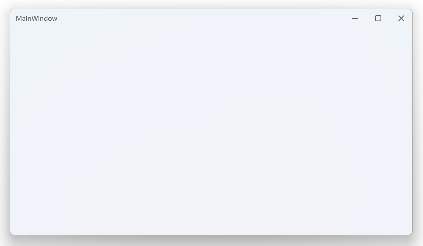

WPFWindowmb

# WPF 自定义标题栏 + Mica 云母效果窗口模板

一个现成的 WPF 自定义标题栏 + 窗口 Mica 云母效果的窗口模板，适用于 Windows 11 及以上系统。

## 特性

- **自定义标题栏**: 完全自定义的窗口标题栏，支持拖拽移动、最小化、最大化、关闭按钮
- **Mica 云母效果**: 应用 Windows 11 的 Mica 视觉效果，呈现现代感的半透明背景
- **窗口控制**: 完整的窗口状态控制（最小化、最大化/还原、关闭）
- **响应式设计**: 适配不同窗口尺寸

## 界面截图



## 技术栈

- .NET Framework / .NET 10
- WPF (Windows Presentation Foundation)
- Windows 11 SDK

## 使用方法

1. 克隆或下载项目
2. 使用 Visual Studio 打开解决方案
3. 编译并运行

## 结构

```
WpfApp1/
├── MainWindow.xaml      # 主窗口 XAML
├── MainWindow.xaml.cs   # 主窗口代码
└── App.xaml             # 应用配置
```